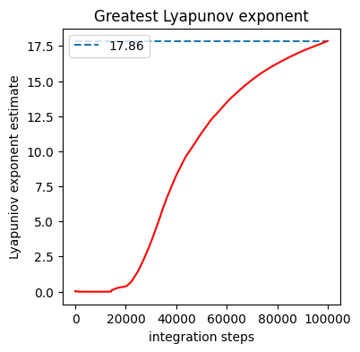

RIKITAKE
========

Rikitake is a Python command line interface (CLI) software able to:
- Integrate the Rikitake Dynamo differential equation system with a Runge-Kutta with user-specified parameters and initial conditions, generating machine-readable solutions 
- Estimate the greatest Lyapunov exponent of the obtained solution 
- Generate plots with informations about the dynamics of the system

Each of these tasks can be performed separately, allowing the user to run the program with more flexibility.

Introduction: The Rikitake dynamo 
===================
The Rikitake Geodynamo is a model proposed by Tsuneji Rikitake in his paper ["Oscillations of a system of disk dynamos" in 1958](https://www.cambridge.org/core/journals/mathematical-proceedings-of-the-cambridge-philosophical-society/article/oscillations-of-a-system-of-disk-dynamos/CDDB16F7655910A13D299B1325A3239B) in order to describe and quantify Earth's magnetic field oscillation. The model consists in a linear system of three differential equations of three time dependant functions *x1*, *x2* and *y1* and two parameters *μ* and *k*. Exaustive theoretical explaination about Rikitake dynamo can be found in the [supplementary material](https://www.youtube.com/watch?v=dQw4w9WgXcQ&app=desktop) or in chapter 14 of ["Fractals and Chaos in Geology and Geophysics" by D. L. Turcotte](https://www.cambridge.org/it/academic/subjects/earth-and-environmental-science/solid-earth-geophysics/fractals-and-chaos-geology-and-geophysics-2nd-edition?format=PB). Within this guide, the basic notions about the system, as well as about dynamic systems, will be considered known and will not be explained. 

#Getting started: download and installation
====================
**add requirements**
You can get Rikitake [here](https://github.com/ManiOrgrim/Rikitake). If you downloaded the .zip file, extract it and you should be able to find the "rikitake" folder in it. 
In order to install and run Rikitake, you need Python v3 ([here](https://www.python.org/)) and pip3 ([here](https://pypi.org/project/pip/)).
From your command line, run the command

~~~
pip3 install -e path/to/rikitake
~~~

where 'path/to/rikitake' should be replaced with the actual path of the rikitake folder in your local computer. When installation is complete, you can run Rikitake from any folder right in your command line, just by running the command:

~~~
rikitake
~~~

If installation was successfull, Rikitake should run properly.

In order to uninstall rikitake, from your command line run the command
~~~
pip3 uninstall rikitake
~~~
You will be asked confirmation before pip proceeds in the uninstallation. Confirm and Rikitake will be correctly uninstalled.
**NOTE:** When you uninstall Rikitake, all the files that it has created will -not- be deleted.

#Running Rikitake: usage tutorial
====================
**First use** 
From your terminal, get in the directory you want Rikitake to operate, and run the command
'rikitake'
Then you should be asked to input the values Rikitake will use to perform the integration. They are
'mu'	(float)	value of the *μ* parameter
'k'	(float)	value of the *k* parameter
'N_steps' (int)	number of integration steps you wish to perform 
x1_0	(float)	value of the initial state for function *x1*
x2_0	(float)	value of the initial state for function *x2*
y1_0	(float)	value of the initial state for function *y1*
sim_ID (string)	identifying string for the simulation.

N_steps determines for how many time steps the integration will be performed. The default time step is *dt*=1/256=0.00390625 (arbitrary time units), if not specified by the user [see here](#errors). This means that the simultation will run until a time value *t*=*dt* * Nsteps, generating Nsteps points as solution. As Nsteps grows, the lyapunov exponent will converge better, but it will take more computation time. 
*simID* functions as a "name" for the simulation: every file that Rikitake will generate will have this string as initial characters. 
**NOTE**: if you run two different simulations with the same simID, the data of the former one will be overwritten, so be careful!

The answer should be given writing all the values separated by a space ' ' character. Press enter to confirm and let Rikitake run. This is the simplest way to use Rikitake.

#How Rikitake works
The Rikitake routine can be summarized in 4 steps:
1. Input reading and creation
2. Integration
3. Estimate of the greatest Lyapunov exponent
4. Image generation

##Input reading and creation
Within this step, Rikitake reads the input the user gave and creates some addition files that will help it run. 
Let us assume the input is
'
3 4 1000000 1 2 3 foo
'
that is: 
the parameters of this simulation are *µ*=3, *k*=4. We will perform 1000000 integration steps. The initial state is given by *x1*=1, *x2*=2, *y1*=3. The simulation identifier is 'foo'.
First, Rikitake will generate an initial condition adjacent to the given initial condition. This initial condition is found by: 
1. calculating the Jacobian matrix of the system 
2. finding the eigenvector *v* relative to the greatest eigenvalue of the Jacobian
3. displacing the initial condition by a factor 2-32 along the direction given by *v*

This creates a new initial condition, slightly different from the first one.
Then, Rikitake will create a file, called 'input_values.txt'. As the name suggests, all the informations about the inputs will be stored here.
The file consists in two lines. The first one is a direct replica of the input the user gave. The second line is the same as the first one, but the initial conditions written will be the perturbed ones. So, for our example input, the 'input_values.txt' file will look like this:

~~~
3 4 100000 1.0 2.0 3.0 foo
3 4 100000 0.9999999999907341 1.999999999990734 2.9999999999352895 foo
~~~
##Integration
In this step, Rikitake reads the ''input_values.txt'' file.
Rikitake reads the first line, extracts the informations about the system and makes a Runge-Kutta 4th-order integration. ''N_Steps'' integrations are performed. 
The results are saved in .csv format, in a file named ''SimID_0.csv'' (where the string ''SimID'' will be replaced by the simulation identifier given in input).
The same is done reading the second line of ''input_values.txt'' creating a file named
 ''SimID_1.csv''. More information about the structure of this output files [here](##The outputs).
 
 So, in our example, we will have our integrations saved in the files "foo_0.csv" and 
 "foo_1.csv".

##Lyapunov exponents estimate
In this step, Rikitake reads the results of the two simulations, and estimates the greatest Lyapunov exponent from these (the calculation procedure is rather complex and will be omitted here. You can find it in the [supplementary material](https://www.youtube.com/watch?v=dQw4w9WgXcQ&app=desktop)). 
Rikitake calcluates the estimated Lyapunov exponent for _each_ timestep of the integration, thus creating a time series of estimated Lyapunov exponents. Given the asymptotical definition of the Lyapunov exponents, the last values are supposed to be the most meaningful, so Rikitake will calculate the mean of the last 1001 
values. This mean value will be stored in a file named "SimIDlyap.dat". The time-series of the Lyapunov exponents will be plotted and saved as an image named 
"SimID_lyap_exp.png"

In our example case, we will find the files "foo_lyap_exp.png" (below) 

and "foolyap.dat", with this content:

~~~
17.857228300870077 
~~~
##Image generation
As final step, Rikitake creates 12 plots, 6 for each integration. These plots made for each integration are: 
1. A 3-dimensional plot of the trajectory of the system in the phase-space
2. A projection of the trajectory in the *x1* *x2* plain
3. A projection of the trajectory in the *x1* *y1* plain
4. A projection of the trajectory in the *x2* *y1* plain
5. A *x1* vs *time* plot
6. A *x2* vs *time* plot

The file format is png. These image naming follows the structure "SimID_"+"simulation number_"+"plot subject", where simulation number is 0 for the unperturbed solution, 1 for the perturbed solution. : for our example case, we will have then:
1. ~~~foo_0_3Dplot.png~~~
2. ~~~foo_0_X1X2.png~~~
3. ~~~foo_0_X1Y1.png~~~
4. ~~~foo_0_Y1X2.png~~~
5. ~~~foo_0_X1time.png~~~
6. ~~~foo_0_X2time.png~~~
7. ~~~foo_1_3Dplot.png~~~
8. ~~~foo_1_X1X2.png~~~
9. ~~~foo_1_X1Y1.png~~~
10. ~~~foo_1_Y1X2.png~~~
11. ~~~foo_1_X1time.png~~~
12. ~~~foo_1_X2time.png~~~

1: 100 is a totally arbitrary value. If you can suggest a more meaningful criterion, you're welcome to share it!
 
##The outputs
Rikitake creates 16 output files:
'

'

#Errors
====================
Describe the error codes. Describe the typical bugs (or wrong usage) one can run into.
Known issues. 

